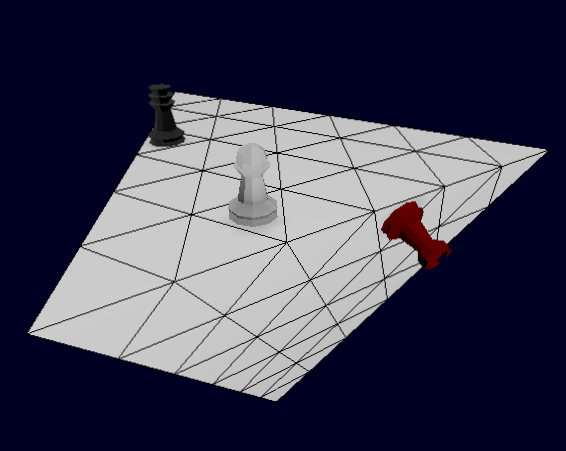

# High Triangle

A chess derivative board-game played upon the surface of a tetrahedron (triangular pyramid). Implemented in the [Godot Engine](https://godotengine.org/).

## Gameplay

There are 2 or 3 armies, consisting of 5 different pieces, 3 of which are familiar from regular, _canonical_ chess: the _pawn_, _knight_ and _rook_ along with the fairy pieces _fers_ and _crown_. The current supported game-mode is _craven_: there is no check or checkmate, the game is over as soon as any crown piece is under attack.

## License

This repository is licensed under the [MIT license](https://opensource.org/licenses/MIT), see the [LICENSE](LICENSE) file for the full legal-text. This is the same license as for the engine upon which this game is based, Godot.

## Running

Should be as simple as importing the **project.godot** file in Godot and pressing run.

## Acknowledgements

* The CS lecturers at Anglia Ruskin University
