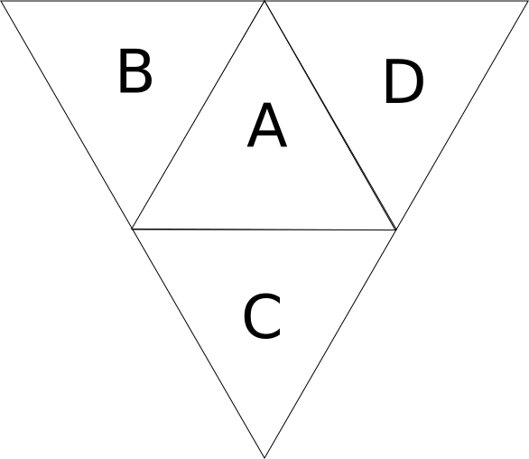

# Guide to Board Construction of Closure Chess

## Vertices

Consider a great triangle, in which the _lesser_ side length is **l**, and with a ratio between the great and lesser side lengths given by **R=3** (hence the greater side length will be **3l**). If one considers the vertices that defines the lesser triangles on the outward face of one great triangle, one way of numbering the vertices is shown below.

One can begin by defining the absolute position of the vertex with index **0** and then positioning every other vertex relative to this _first position_. Continuing, consider every row: each vertex on this row has the same position relative to the vertical as every other; hence one can take the leftmost vertex as another orientation point, and move rightwards.

The procedure is to start with the leftmost vertex of each row's position; place a vertex; move rightwards, placing a vertex every distance equal to _half_ of **l** until the boundary of the great triangle is reached; move the absolute position in a direction at an angle **30** degrees to the right of the vertical a distance **l** and, if the top of the great triangle has not been reached; _repeat_ the previous steps.

This results in a number of vertices per great given by **nv=(R*(R+3)/2)+1**, equal to **28** for the canonical board of ratio **R=6**.

To place the vertices of the other **3** greats, one requires a rotation matrix composed of **2** rotations for each great. The below picture shows the arrangement of the **4** greats labeled **A**, **B**, **C**, and **D**.

The vertices array is constructed by appending the vertices of each great in ascending order (_i.e._ **A**, **B**, **C**, and then **D**).

The _vector_ **ABC** is the position vector of the corner around which one would rotate, counter-clockwise from **A** by **120** degrees, to reach first great **B** and then **C**. The _vectors_ **ACD** and **ADB** are similarly defined. The rotations around axis **ABC**, **ACD**, and **ADB** by **120** degrees counter-clockwise are the first rotations of the compound rotation matrices to reach greats **B**, **C**, and **D** respectively.

Though not strictly necessary, for reasons of convenience another rotation is then applied, _i.e._ the rotation counter-clockwise by **120** degrees of the vertices of a great around the normal of the surface of said great. This eases implementation of the lesser triangles due to the consistent orientation of each of the _outer_ greats **B**, **C**, and **D**.

## Edges

To draw the edge of every lesser triangle on one great triangle, it suffices to draw **R-1** lines in each of **3** directions: horizontally, and in either direction at an angle of **30** degrees to the vertical (where the triangle is oriented as in the vertex map above). To know which vertices to connect requires some understanding of polynomial (up to quadratic) progressions.
